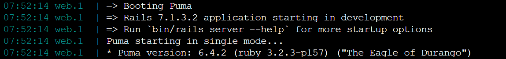
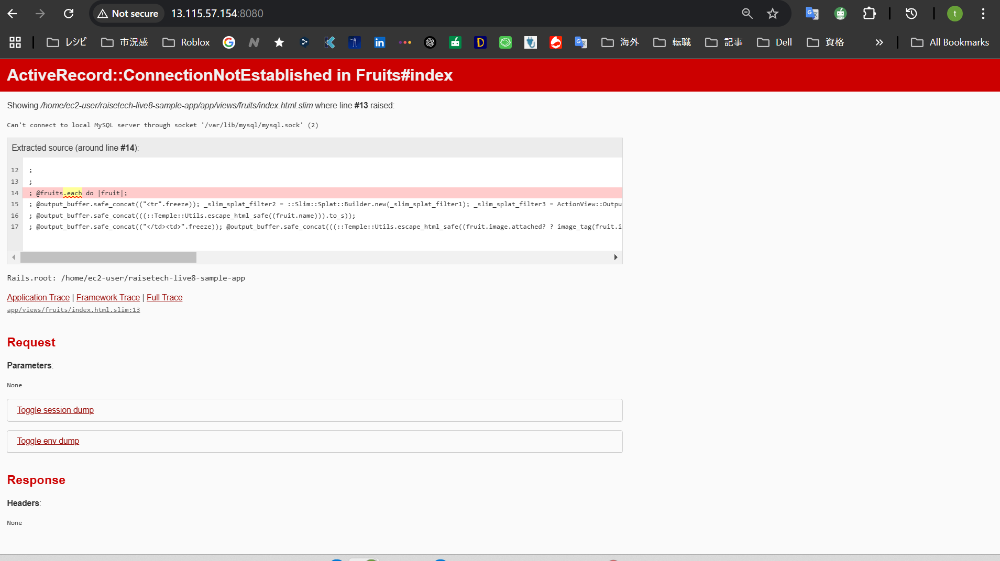

# 第三回課題
## APサーバーについて調べる
- AP サーバーの名前とバージョン

- 停止後はWEBブラウザへの接続不可。起動後も再度bin/cloud9_devを再実行する必要あり
## DB サーバーについて調べる
- DB サーバーの名前とバージョン

- DBサーバー停止後は下記のエラーとなる

## railsのどの構成管理ツールを使っているか
- 代表的なRails の構成管理ツールdotenv, figaro, config などが環境変数、各所管理ファイルなどに存在しないため。存在しない
