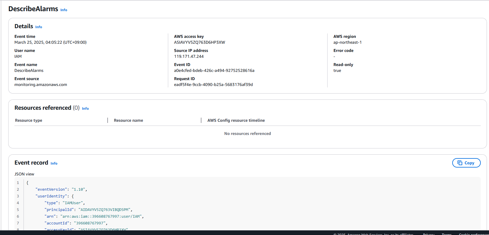
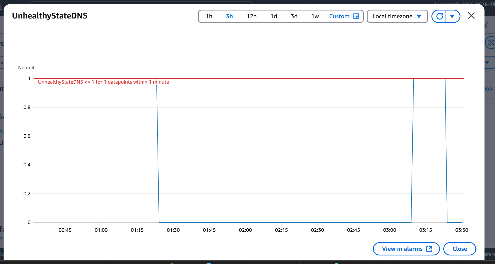
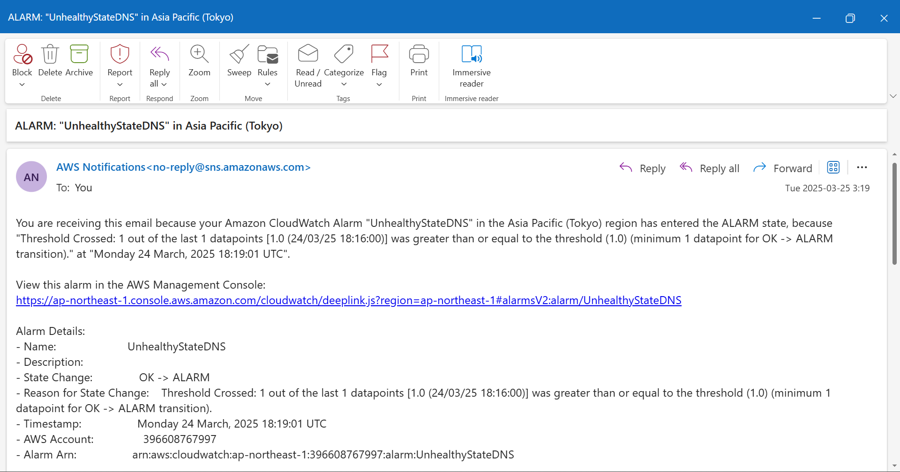
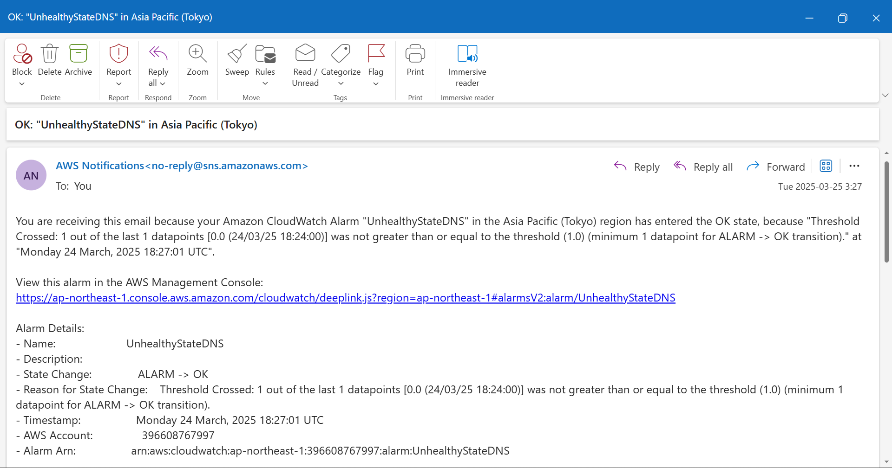
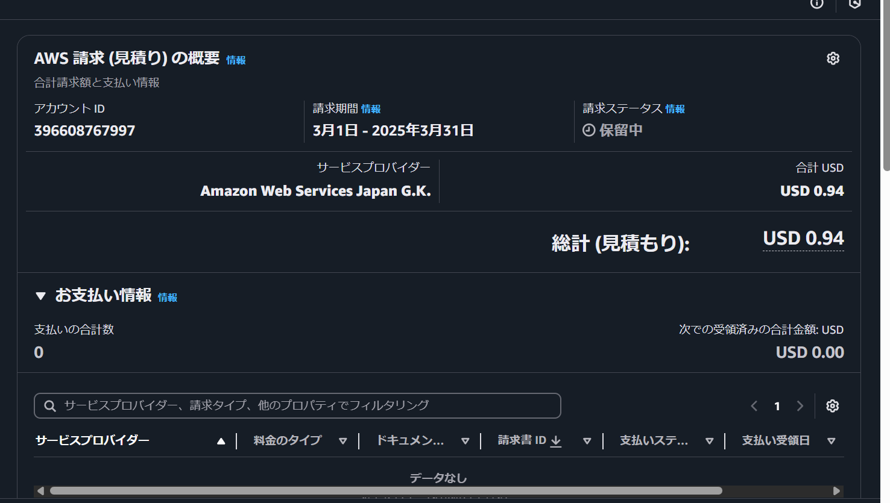
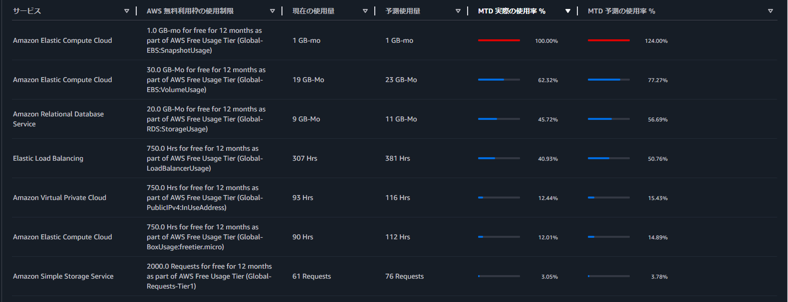
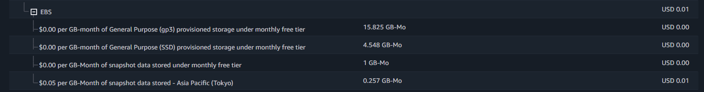

# 第六回課題
1. CloudTrailにてイベントをピックアップ 
イベント名：DescribeAlarms 
含まれている内容： 
・イベント時間："eventTime": "2025-03-24T19:05:22Z" 
・イベントソース："eventSource": "monitoring.amazonaws.com"  
・AWSリージョン："awsRegion": "ap-northeast-1" 
  

2. ALBのCloudWatch Alarm 
  
 
 

3. 第5回で構築した環境の利用料を見積る(AWS pricing calculator) 
https://calculator.aws/#/estimate?id=2f22eef7c5e6121d9c5471f0191901ae2c09d6fb
 
 
考察： 
今月課金額が発生してしまった主な理由はEIPによるものでした。こちら調査の結果使用状況がidleでもin useでも無料枠に含まれず課金されてしまうようでしたので、使用が終わったらreleaseする運用のやり方に変更しました。EC2のsnapshotの予測値が100%を超えておりますが、一時的に作成してしまい、すぐに削除しましたので、実際の請求書は下記の通りほぼ無料枠におさまっております。
 
