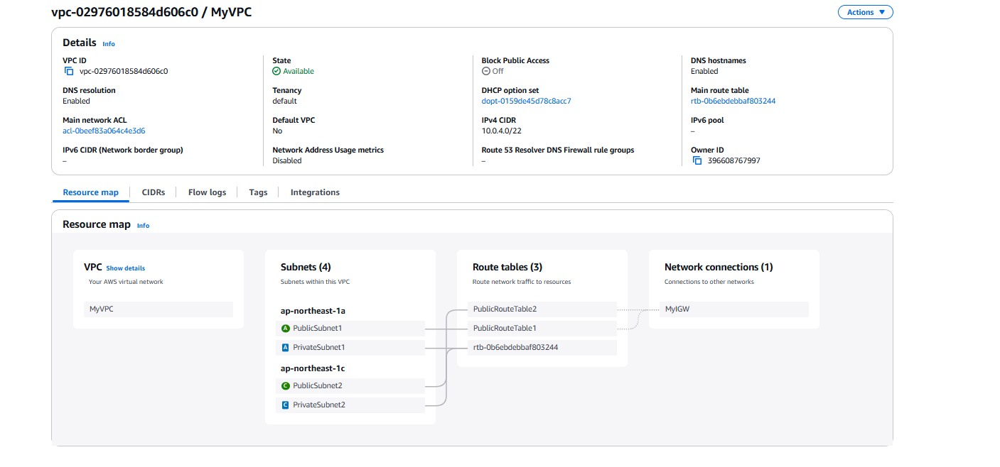
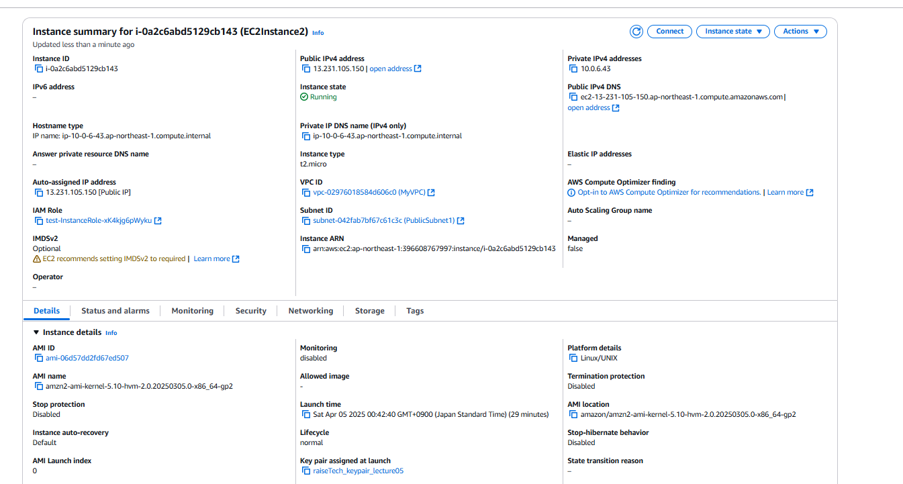
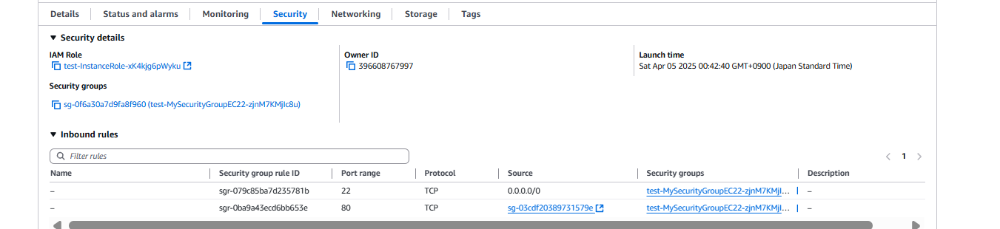
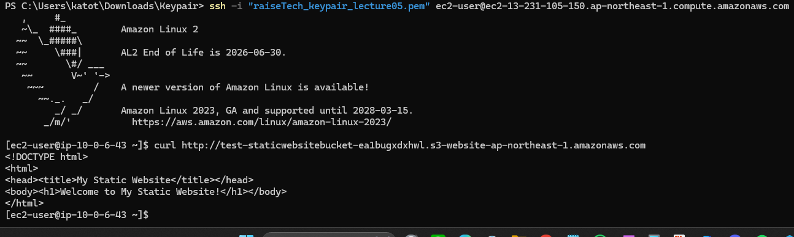
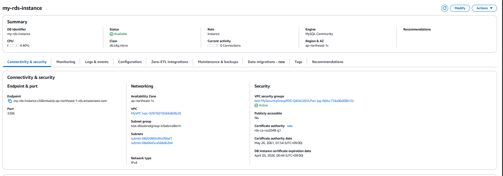
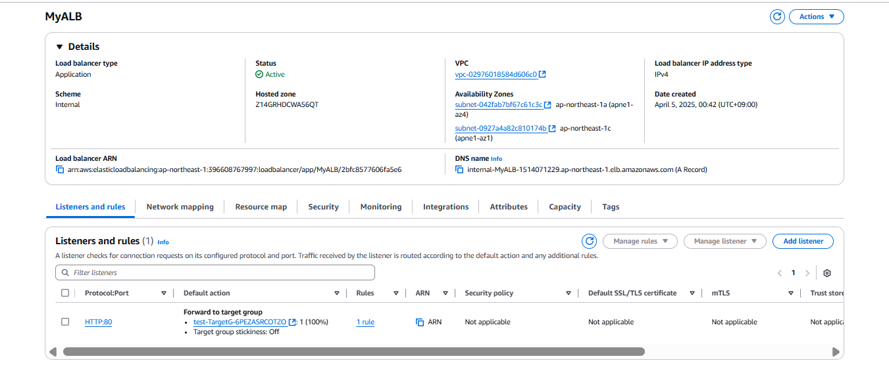
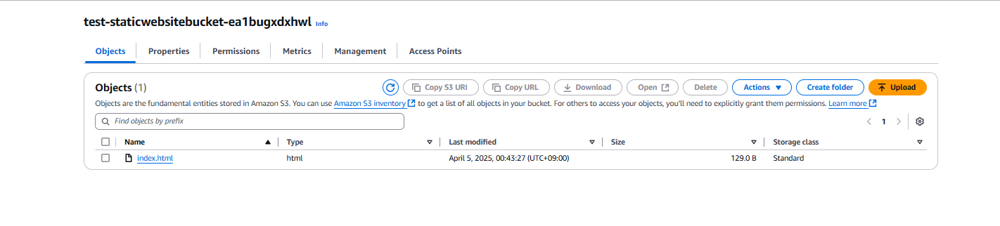

# 第１０回課題
* ※CFn→CloudFormation

## CFnに使用したymlファイル
* [template.yaml](template.yaml)

## CFnで作成したリソース
* VPC

* EC2

  - EC2のインバウンド
  
  - S3に自動アップロードした静的ウェブサイトにアクセスできるか動作確認
  
* RDS

* ELB

* S3

## CFnで作成したリソースに接続できるか確認
* CFnで作成したリソース間の接続(EC2→RDS)

## 感想
* S3へのファイルアップロードの実装が難しかった。UserDataとAWS::CloudFormation::Initを用いて何とかできました。今回はS3をパブリックアクセスを最初から有効にしたので、次回機会があればパブリックアクセスを無効にした状態でも同じアクセスできるかどうかも試してみたい。
