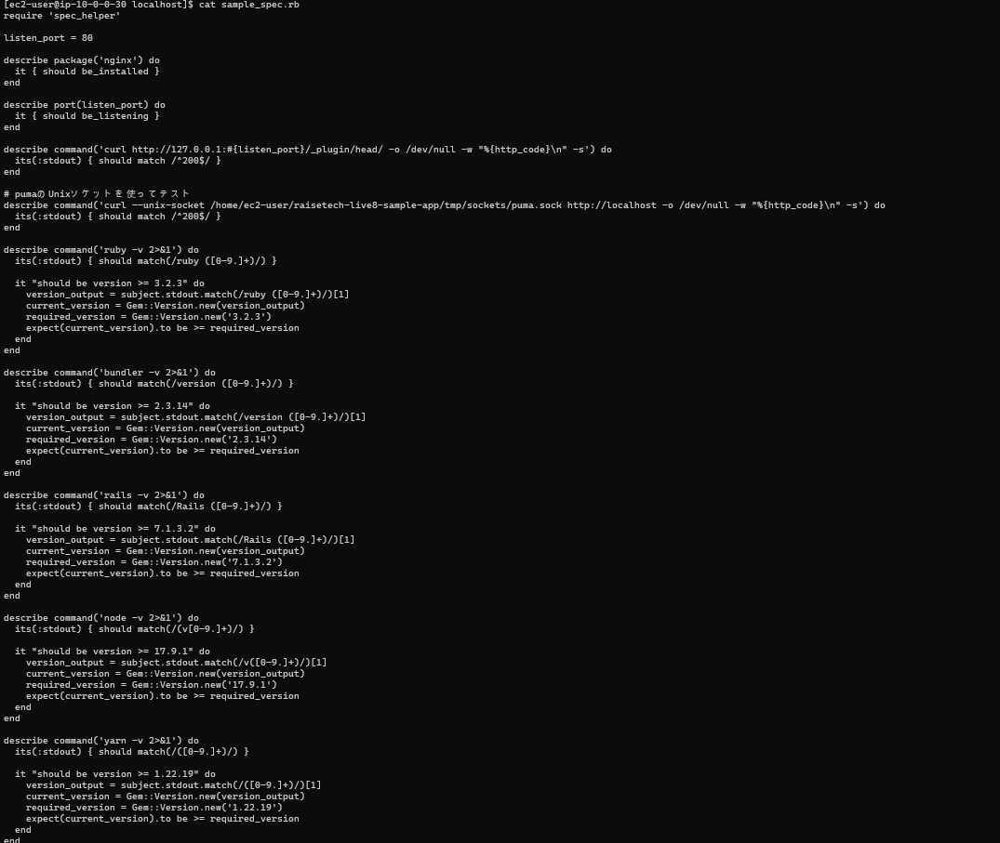
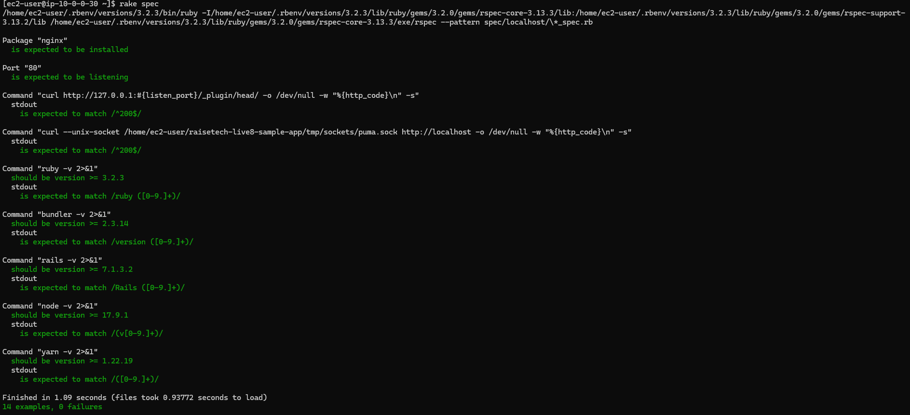

# 第十一回課題 Serverspec

1. 事前準備
$ gem install serverspec 
$ serverspec-init 
Choose localhost 

2. テスト項目
 

3. 実行結果
 

4. 感想
なぜソケットでリッスンしているのに80番ポートでリッスンしているかどうかのテストがパスしているのか調べるの苦労したが、80番ポートでリッスンしているのはpumaではなくnginxであると理解した。
