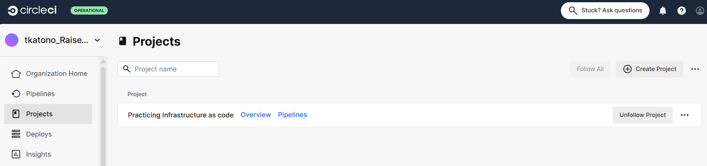
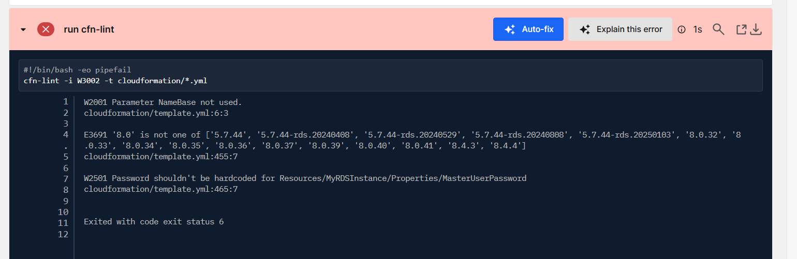
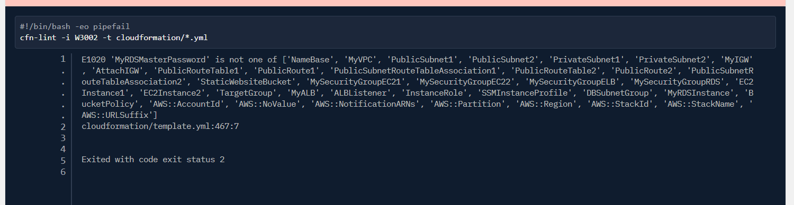
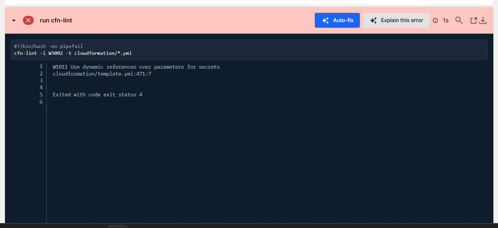
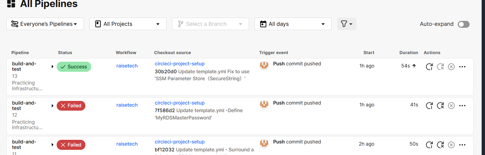
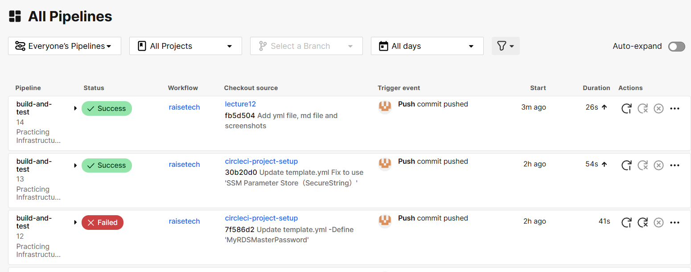

# 第 12 回課題:CI/CDツール CircleCI

## 概要

- CircleCI のサンプルコンフィグが動作するようにリポジトリに組み込む。  
- cfn-lint を用いて CloudFormation の記述内容が正しく動作するか確認する。  

## まずは `circleci-project-setup` リポジトリを新規作成して試してみる  

- CircleCI 側で新しくブランチを切って config.yml を作成  

  

**config.yml を下記のように書き換える**  

```
version: 2.1
orbs:
  python: circleci/python@2.0.3
jobs:
  cfn-lint:
    executor: python/default
    steps:
      - checkout
      - run: pip install cfn-lint
      - run:
          name: run cfn-lint
          command: |
            cfn-lint -i W3002 -t templates/*.yml
workflows:
raisetech:
jobs: - cfn-lint
```

**リモートにプッシュして CircleCI を確認する**  

- NameBase未使用、RDSのmysqlのバージョン指定ミス、RDSのパスワードがハードコーディングされているミス。  
  
- パラメータとしてパスワードを指定し忘れ

- Secrets Manager や SSMを使えと怒られる
  

**ようやく成功



## 本番用ブランチ作成

- 既に作成したブランチをリネームすればよいのでは？と考えたが、安易にリネームするとビルドが通らなくなったりするそうなので、新規でブランチを切る

**実行結果を確認**

- テストで作成したリポジトリで 1 度試した甲斐もあり、そのままストレートで成功した。



## 感想・学んだこと

- エラーだけでなく警告も拾ってくるので、基本やエラーをつぶすのが優先でしたが、Secret ManagerやSSMの利用等初めて使うサービスもあり、勉強になりました。
- 今回学んだcommitをトリガーにしてビルドを実施する以外の、ジョブやトリガー等もあるはずなので、バリエーションを増やしていきたい
