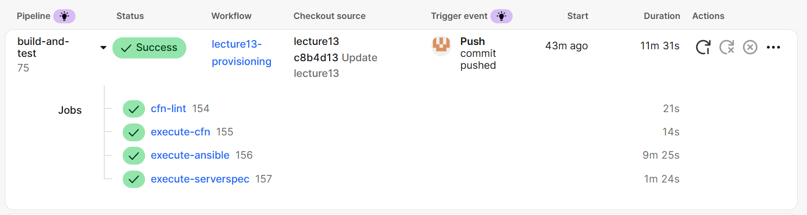

# 第 13 回課題:Cloudformation,Serverspec,CircleCI,Ansibleによる自動デプロイ
## 概要
- GithubのコミットをトリガーにAWSリソースの作成→アプリの構成のインストール→テストの一連の流れを自動化
- 画像が正常に表示されない問題をminimagikを利用することによって改善
- アプリ上で保存された画像をアプリ上ではなくS3に格納するように変更*1
- その際に自動で画像の調整が入ったものが重複して保存されてしまう画像のリサイズ工程を削除*2

1. 第13回用にブランチを切り、config.ymlをコピー
2. コントロールノードとしてのEC2を別に用意するのではなく、CircleCIから直接ターゲットノードに設定を入れていく
3. 結果
  
4. 感想
    - ALBのDNSをconfig.hostsに許可しているのにBlocked hostsのエラーが出る現象で丸二日くらい悩んでしまった。rbのファイを変更するときはAppliation Serverを再起動することが意外と大事
    - 第5回でメモしていたパッケージインストール手順を元にAnsibleのタスクを実装していったのにJavaScript関係のエラーが消えずに半月くらい悩む。yarn buildが実行できておらず必要なファイルが生成されていなかったことが原因。buildすること初めて生成されるファイルもあるので適切にbuildされているかどうかも重要であることを学びました。
    - 一度Ansibleを実行すると、二回目に再度実行用とした時になぜかSSHができない事象が発生。これでまた2,3日悩む。ディレクトリのパーミッションが緩すぎたことが原因。エラーが発生した時はコードそのものと合わせて、実行前後の手順も確認することが大事と学びました。
5. 残課題  
    \*1\*2はAnsibleに未反映